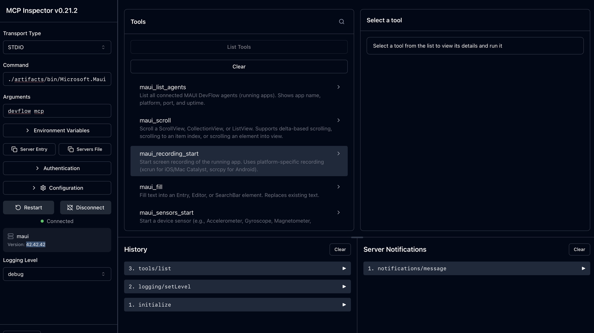

# Testing the DevFlow MCP Server

The DevFlow CLI includes an [MCP (Model Context Protocol)](https://modelcontextprotocol.io/) server that exposes MAUI automation tools to AI agents. This guide explains how to verify the MCP server is working correctly.

## Prerequisites

- [.NET 10 SDK](https://dotnet.microsoft.com/download/dotnet/10.0) (see `global.json` for exact version)
- [Node.js](https://nodejs.org/) (for the MCP Inspector)
- The `maui` CLI built from source (see [Building](#build-the-cli) below)

## Build the CLI

```bash
dotnet build src/Cli/Microsoft.Maui.Cli/ --configuration Release
```

The built executable is at:

```
# macOS / Linux
artifacts/bin/Microsoft.Maui.Cli/Release/net10.0/maui

# Windows
artifacts\bin\Microsoft.Maui.Cli\Release\net10.0\maui.exe
```

> **Tip:** The project multi-targets `net9.0` and `net10.0`. Both outputs are produced — use the `net10.0` one. You can also run via `dotnet artifacts/bin/Microsoft.Maui.Cli/Release/net10.0/maui.dll` on any platform.

Verify the MCP command is available:

```bash
./artifacts/bin/Microsoft.Maui.Cli/Release/net10.0/maui devflow mcp --help
```

## Testing with the MCP Inspector

The [MCP Inspector](https://github.com/modelcontextprotocol/inspector) is a web-based tool for interactively testing MCP servers. It connects to the server over stdio and lets you browse and invoke tools.

### Launch the inspector

```bash
npx @modelcontextprotocol/inspector ./artifacts/bin/Microsoft.Maui.Cli/Release/net10.0/maui devflow mcp
```

This opens a web UI at **http://localhost:6274**.



### What to verify

1. **Connection** — The bottom-left of the inspector should show a green "Connected" indicator with the server name `maui` and its version.
2. **Tools list** — Click **List Tools** to see all `maui_*` tools. You should see tools like `maui_list_agents`, `maui_tree`, `maui_screenshot`, `maui_tap`, etc.
3. **Tool invocation** — Select a tool (e.g., `maui_list_agents`) and click **Run** to invoke it. Without a running MAUI app the call will return an error or empty list, which is expected — the goal is to confirm the MCP server responds.
4. **History** — The History panel at the bottom tracks all MCP protocol messages (`initialize`, `tools/list`, tool calls), which is useful for debugging.

## Testing with a running MAUI app

To fully test tool invocation, you need a MAUI app with the DevFlow agent NuGet package:

```bash
# Terminal 1: Start the broker
maui devflow broker start

# Terminal 2: Run your MAUI app (it registers with the broker automatically)
dotnet run --project path/to/your/MauiApp

# Terminal 3: Launch the MCP Inspector
npx @modelcontextprotocol/inspector ./artifacts/bin/Microsoft.Maui.Cli/Release/net10.0/maui devflow mcp
```

Then in the inspector:

1. Call `maui_list_agents` — should return your running app
2. Call `maui_tree` — should return the visual tree hierarchy
3. Call `maui_screenshot` — should return an image of the app

## Configuring in AI tools

You can also test by configuring the MCP server in an AI tool that supports MCP (e.g., Claude Desktop, VS Code with GitHub Copilot, Cursor):

```json
{
  "mcpServers": {
    "maui-devflow": {
      "command": "maui",
      "args": ["devflow", "mcp"]
    }
  }
}
```

> **Note:** This assumes the `maui` CLI is installed as a global tool (`dotnet tool install -g Microsoft.Maui.Cli`). For a local build, use the full path to the built executable.

## Manual stdio test

For a quick smoke test without Node.js, you can send a raw MCP initialize request:

```bash
echo '{"jsonrpc":"2.0","id":1,"method":"initialize","params":{"protocolVersion":"2024-11-05","capabilities":{},"clientInfo":{"name":"test","version":"0.1"}}}' \
  | ./artifacts/bin/Microsoft.Maui.Cli/Release/net10.0/maui devflow mcp
```

A successful response includes the server name, version, and capabilities.

## Troubleshooting

| Problem | Solution |
|---------|----------|
| `command not found: maui` | Use the full path to the built binary or install as a global tool |
| MCP Inspector shows "Disconnected" | Check that the build succeeded and the binary path is correct |
| `npm EACCES` permission errors | See the [npm docs on resolving EACCES permissions](https://docs.npmjs.com/resolving-eacces-permissions-errors-when-installing-packages-globally). Using [nvm](https://github.com/nvm-sh/nvm) avoids this issue entirely. |
| Tools return connection errors | Start the broker (`maui devflow broker start`) and a MAUI app with the DevFlow agent |
| Inspector can't install | Ensure Node.js ≥ 18 is installed and `npx` is available |
