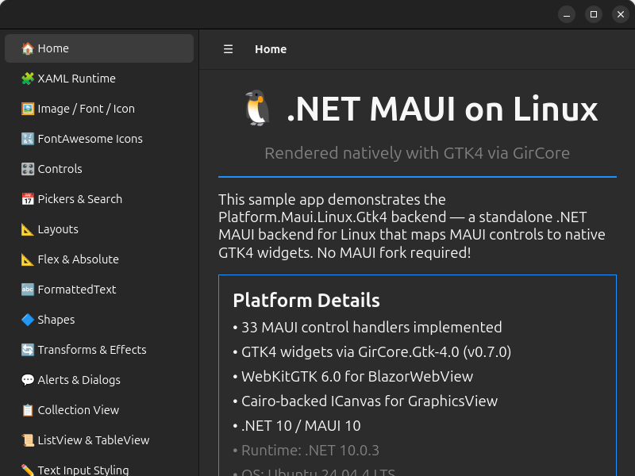
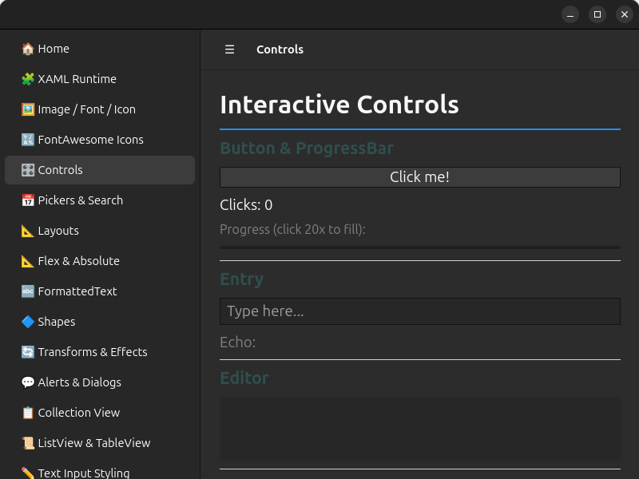
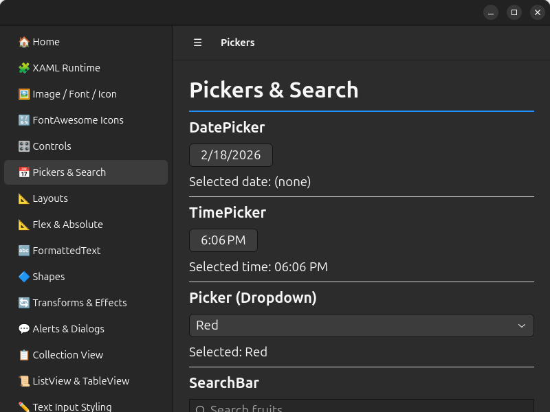
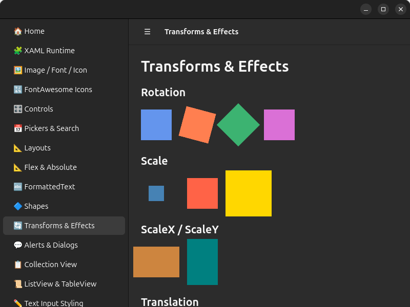

# Microsoft.Maui.Platforms.Linux.Gtk4

A .NET MAUI backend for Linux, powered by **GTK4**. Run your .NET MAUI applications natively on Linux desktops with GTK4 rendering via [GirCore](https://github.com/gircore/gir.core) bindings.

> **Status:** Early / experimental — contributions and feedback are welcome!

https://github.com/user-attachments/assets/70f2a910-94b3-437c-945a-6b71223c5cd3

## Screenshots

<table>
<tr>
<td><br/><b>Home & Sidebar Navigation</b></td>
<td><br/><b>Interactive Controls</b></td>
</tr>
<tr>
<td><br/><b>CollectionView (Virtualized)</b></td>
<td><br/><b>FontAwesome Icons</b></td>
</tr>
<tr>
<td><br/><b>Shapes & Graphics</b></td>
<td><br/><b>Layouts</b></td>
</tr>
<tr>
<td><br/><b>ControlTemplate & ContentPresenter</b></td>
<td><br/><b>Pickers & Search</b></td>
</tr>
<tr>
<td><br/><b>FormattedText & Spans</b></td>
<td><br/><b>Transforms & Effects</b></td>
</tr>
<tr>
<td colspan="2"><br/><b>GraphicsView (Cairo)</b></td>
</tr>
</table>

## Features

### Controls and handlers

| Category | Controls |
|----------|----------|
| **Basic Controls** | Label, Button, Entry, Editor, CheckBox, Switch, Slider, Stepper, ProgressBar, ActivityIndicator, Image, ImageButton, BoxView, RadioButton |
| **Input & Selection** | Picker, DatePicker, TimePicker, SearchBar |
| **Collections** | CollectionView (virtualized `Gtk.ListView`), ListView, TableView, CarouselView, SwipeView, RefreshView, IndicatorView |
| **Layouts** | StackLayout, Grid, FlexLayout, AbsoluteLayout, ScrollView, ContentView, Border, Frame |
| **Pages & Navigation** | ContentPage, NavigationPage, TabbedPage, FlyoutPage, Shell (flyout, tabs, route navigation) |
| **Shapes** | Rectangle, Ellipse, Line, Path, Polygon, Polyline — Cairo-rendered with fill, stroke, dash patterns |
| **Other** | GraphicsView (Cairo), WebView (WebKitGTK) |

> **Layout architecture:** StackLayout, Grid, FlexLayout, and AbsoluteLayout all share a single `LayoutHandler` — the MAUI `Layout` base class is mapped once, and all concrete layout types resolve through it.

### Platform Features

- **Native GTK4 rendering** — Every control maps to a real GTK4 widget, styled via GTK CSS.
- **Blazor Hybrid** — Host Blazor components inside a native GTK window via WebKitGTK.
- **Gestures** — Tap, Pan, Swipe, Pinch, and Pointer gesture recognizers via GTK4 event controllers.
- **Animations** — `TranslateTo`, `FadeTo`, `ScaleTo`, `RotateTo` via `GtkPlatformTicker` + `Gsk.Transform` at ~60fps.
- **Transforms** — TranslationX/Y, Rotation, Scale via `Gsk.Transform`; Shadow (CSS `box-shadow`), Clip, ZIndex.
- **VisualStateManager** — Normal, PointerOver, Pressed, Disabled, Focused states via GTK4 event controllers.
- **ControlTemplate** — Full ContentPresenter and TemplatedView support via `IContentView` handler mapping.
- **Font icons** — Embedded font registration with fontconfig/Pango, FontImageSource rendering via Cairo. FontAwesome and custom icon fonts work out of the box.
- **FormattedText** — Rich text via Pango markup: Span colors, fonts, sizes, bold/italic, underline/strikethrough, character spacing.
- **Alerts & Dialogs** — `DisplayAlert`, `DisplayActionSheet`, `DisplayPromptAsync` via native GTK4 modal windows.
- **Modal Pages** — `PushModalAsync` presents pages as native GTK4 dialog windows by default, with attached properties for custom sizing, content-fit sizing, and inline (legacy) presentation via `GtkPage`.
- **Brushes & Gradients** — SolidColorBrush, LinearGradientBrush, RadialGradientBrush via CSS gradients.
- **MenuBar** — `MenuBarItem` / `MenuFlyoutItem` via `Gtk.PopoverMenuBar`, integrated into Window and NavigationPage handlers via `GtkMenuBarManager` (not a standalone handler).
- **Tooltips & Context Menus** — `ToolTipProperties.Text` and `ContextFlyout` via `Gtk.PopoverMenu`.
- **Theming** — Automatic light/dark theme detection via `GtkThemeManager`.
- **Lifecycle Events** — `ConfigureLifecycleEvents().AddGtk()` hooks for `OnWindowCreated` and `OnMauiApplicationCreated`.
- **Desktop integration** — App icons via hicolor icon theme, `.desktop` file generation, `MauiImage`/`MauiFont`/`MauiAsset` resource processing.

### Essentials (21 of 36 services)

| Status | Services |
|--------|----------|
| ✅ **Done** (21) | AppInfo, AppActions, Battery (UPower), Browser (`xdg-open`), Clipboard (`Gdk.Clipboard`), Connectivity (NetworkManager), DeviceDisplay, DeviceInfo, Email (`xdg-open mailto:`), FilePicker (`Gtk.FileDialog`), FileSystem (XDG dirs), Launcher, Map, MediaPicker, Preferences (JSON), Screenshot, SecureStorage, SemanticScreenReader (AT-SPI), Share (XDG Portal), TextToSpeech (`espeak-ng`), VersionTracking |
| ⚠️ **Partial** (2) | Geolocation (GeoClue — basic location only), WebAuthenticator (basic OAuth via system browser) |
| ❌ **Stub** (13) | Accelerometer, Barometer, Compass, Contacts, Flashlight, Geocoding, Gyroscope, HapticFeedback, Magnetometer, OrientationSensor, PhoneDialer, SMS, Vibration — sensors and phone-specific APIs not applicable to desktop Linux |

### Implementation Parity

| Category | Coverage | Notes |
|----------|----------|-------|
| Core Infrastructure | 100% | Dispatcher, handler factory, rendering pipeline |
| Pages | 100% | ContentPage, NavigationPage, TabbedPage, FlyoutPage, Shell |
| Layouts | 100% | All layout types including FlexLayout and AbsoluteLayout |
| Basic Controls | 100% | All 14 standard controls |
| Input Controls | 100% | Picker, DatePicker, TimePicker, SearchBar |
| Collection Controls | 100% | Virtualized CollectionView, ListView, TableView, CarouselView, SwipeView |
| Navigation & Routing | 100% | Push/pop, Shell routes, query parameters |
| Alerts & Dialogs | 100% | All three dialog types + native modal dialog windows |
| Gesture Recognizers | 100% | All 5 gesture types |
| Graphics & Shapes | 100% | GraphicsView + all 6 shape types |
| Font Management | 100% | Registrar, manager, FontImageSource, named sizes |
| WebView | 100% | URL, HTML, JavaScript, navigation events |
| Animations | 100% | All animation types via GtkPlatformTicker |
| VisualStateManager | 100% | All visual states + triggers + behaviors |
| ControlTemplate | 100% | ContentPresenter, TemplatedView |
| Base View Properties | 100% | Opacity, visibility, transforms, shadow, clip, automation |
| FormattedText | 100% | All Span properties via Pango markup |
| MenuBar | 100% | MenuBarItem, MenuFlyoutItem, popover menus — integrated into Window and NavigationPage handlers |
| Essentials | 64% | 21 done + 2 partial of 36 total; 13 stubs (sensors/phone N/A on desktop) |

## Prerequisites

| Requirement | Version |
|---|---|
| .NET SDK | 10.0+ |
| GTK 4 libraries | 4.x (system package) |
| WebKitGTK *(Blazor only)* | 6.x (system package) |

### Install GTK4 & WebKitGTK (Debian / Ubuntu)

```bash
sudo apt install libgtk-4-dev libwebkitgtk-6.0-dev \
  gobject-introspection libgirepository1.0-dev \
  gir1.2-gtk-4.0 gir1.2-webkit-6.0 pkg-config
```

### Install GTK4 & WebKitGTK (Fedora)

> **Note:** Fedora package names below are unverified. Please open an issue if they need correction.

```bash
sudo dnf install gtk4-devel webkitgtk6.0-devel \
  gobject-introspection-devel pkg-config
```

> On Fedora versions where these package names apply, `gtk4-devel` and `webkitgtk6.0-devel` typically include the GObject Introspection typelibs, so separate `gir1.2-*` packages are usually not needed.

## Quick Start

### Option 1: Use the template (recommended)

```bash
# Install the template
dotnet new install Microsoft.Maui.Platforms.Linux.Gtk4.Templates --prerelease

# Create a new Linux MAUI app
dotnet new maui-linux-gtk4 -n MyApp.Linux
cd MyApp.Linux
dotnet run
```

### Option 2: Add to an existing project manually

Add the NuGet package:

```bash
dotnet add package Microsoft.Maui.Platforms.Linux.Gtk4 --prerelease
dotnet add package Microsoft.Maui.Platforms.Linux.Gtk4.Essentials --prerelease   # optional
```

Then set up your entry point:

**Program.cs**

```csharp
using Microsoft.Maui.Platforms.Linux.Gtk4.Platform;
using Microsoft.Maui.Hosting;

public class Program : GtkMauiApplication
{
    protected override MauiApp CreateMauiApp() => MauiProgram.CreateMauiApp();

    public static void Main(string[] args)
    {
        var app = new Program();
        app.Run(args);
    }
}
```

**MauiProgram.cs**

```csharp
using Microsoft.Maui.Platforms.Linux.Gtk4.Hosting;
using Microsoft.Maui.Hosting;

public static class MauiProgram
{
    public static MauiApp CreateMauiApp()
    {
        var builder = MauiApp
            .CreateBuilder()
            .UseMauiAppLinuxGtk4<App>();

        return builder.Build();
    }
}
```

## XAML Support

`Microsoft.Maui.Platforms.Linux.Gtk4` relies on MAUI's normal transitive build assets for XAML.
In Linux head projects, `*.xaml` files are still collected as `MauiXaml` and compiled by MAUI's XAML build pipeline without extra package-specific overrides.

## Resource Item Support

Linux head projects can use MAUI resource item groups for common `Resources/*` paths:

- `MauiImage` from `Resources/Images/**`
- `MauiFont` from `Resources/Fonts/**`
- `MauiAsset` from `Resources/Raw/**` (with `LogicalName` defaulting to `%(RecursiveDir)%(Filename)%(Extension)`)
- `MauiIcon` from explicit items, or default `Resources/AppIcon/appicon.{svg|png|ico}`

These are copied into build/publish output so image/file lookups can resolve at runtime.
When `MauiIcon` is present, Linux builds emit `hicolor` icon-theme files in output and runtime sets the GTK window default icon name from that icon.

## Adding Linux to a Multi-Targeted MAUI App

Since there is no official `-linux` TFM (Target Framework Moniker) from Microsoft, MAUI projects can't conditionally include the Linux backend via `TargetFrameworks` the way they do for Android/iOS/Windows. Instead, use the **"Linux head project"** pattern:

```
MyApp/                              ← Your existing multi-targeted MAUI project
├── MyApp.csproj                       (net10.0-android;net10.0-ios;...)
├── App.cs
├── MainPage.xaml
├── ViewModels/
├── Services/
└── Platforms/
    ├── Android/
    ├── iOS/
    └── ...

MyApp.Linux/                        ← New Linux-specific project
├── MyApp.Linux.csproj                 (net10.0, references Microsoft.Maui.Platforms.Linux.Gtk4)
├── Program.cs                         (GtkMauiApplication entry point)
└── MauiProgram.cs                     (builder.UseMauiAppLinuxGtk4<App>())
```

### Setup

1. **Create the Linux head project** next to your MAUI project:

```bash
dotnet new maui-linux-gtk4 -n MyApp.Linux
```

2. **Reference your shared code** — add a project reference from `MyApp.Linux.csproj` to your MAUI project (or a shared class library):

```xml
<!-- MyApp.Linux.csproj -->
<ItemGroup>
  <ProjectReference Include="../MyApp/MyApp.csproj" />
</ItemGroup>
```

3. **Run on Linux:**

```bash
dotnet run --project MyApp.Linux
```

### Why a separate project?

The platform-specific TFMs (`net10.0-android`, `net10.0-ios`, etc.) are powered by .NET workloads that Microsoft ships. Creating a custom `net10.0-linux` TFM would require building and distributing a full .NET workload — complex infrastructure that's unnecessary for most use cases.

The separate project approach works with standard `dotnet build`/`dotnet run`, is NuGet-distributable, and keeps your existing MAUI project unchanged.

## DevFlow Integration

The GTK4 backend supports [DevFlow](../../src/DevFlow/) for AI-assisted UI inspection, automation, and debugging, including the Blazor CDP bridge. To enable it, set `EnableMauiDevFlow=true` in `Directory.Build.props` (or pass it as an MSBuild property):

```xml
<!-- Directory.Build.props -->
<PropertyGroup>
  <EnableMauiDevFlow>true</EnableMauiDevFlow>
</PropertyGroup>
```

When enabled, the sample project (`samples/Linux.Gtk4.Sample`) conditionally references the DevFlow agent and Blazor projects:

```xml
<ItemGroup Condition="'$(EnableMauiDevFlow)' == 'true'">
  <ProjectReference Include="..\..\..\..\src\DevFlow\Microsoft.Maui.DevFlow.Agent.Gtk\Microsoft.Maui.DevFlow.Agent.Gtk.csproj" />
  <ProjectReference Include="..\..\..\..\src\DevFlow\Microsoft.Maui.DevFlow.Blazor.Gtk\Microsoft.Maui.DevFlow.Blazor.Gtk.csproj" />
</ItemGroup>
```

## Building from Source

```bash
git clone https://github.com/dotnet/maui-labs.git
cd maui-labs/platforms/Linux.Gtk4
dotnet restore
dotnet build
```

### Run the sample app

```bash
# Sample app (includes native controls, Blazor Hybrid, essentials, and more)
dotnet run --project samples/Linux.Gtk4.Sample
```

## Project Structure

```
Linux.Gtk4.slnx                                            # Platform-local solution file
├── src/
│   ├── Linux.Gtk4/                                         # Core MAUI backend
│   │   ├── Handlers/                     # GTK4 handler implementations
│   │   ├── Hosting/                      # AppHostBuilderExtensions (UseMauiAppLinuxGtk4)
│   │   └── Platform/                     # GTK application, context, layout, theming
│   ├── Linux.Gtk4.Essentials/                             # MAUI Essentials for Linux (clipboard, etc.)
│   └── Linux.Gtk4.BlazorWebView/                          # BlazorWebView support via WebKitGTK
├── samples/
│   └── Linux.Gtk4.Sample/                                 # Sample app (controls, Blazor, essentials)
├── templates/                            # dotnet new templates
└── docs/                                 # Documentation
```

## NuGet Packages

| Package | Purpose |
|---|---|
| `Microsoft.Maui.Platforms.Linux.Gtk4` | Core GTK4 backend — handlers, hosting, platform services |
| `Microsoft.Maui.Platforms.Linux.Gtk4.Essentials` | MAUI Essentials (clipboard, preferences, device info, etc.) |
| `Microsoft.Maui.Platforms.Linux.Gtk4.BlazorWebView` | Blazor Hybrid support via WebKitGTK |
| `Microsoft.Maui.Platforms.Linux.Gtk4.Templates` | `dotnet new` project templates |

## Key Dependencies

| Package | Purpose |
|---|---|
| `GirCore.Gtk-4.0` | GObject introspection bindings for GTK4 |
| `GirCore.WebKit-6.0` | WebKitGTK bindings (Blazor support) |
| `Microsoft.Maui.Controls` | .NET MAUI framework |
| `Tmds.DBus.Protocol` | D-Bus client for Linux platform services |

## License

This project is licensed under the [MIT License](LICENSE).
